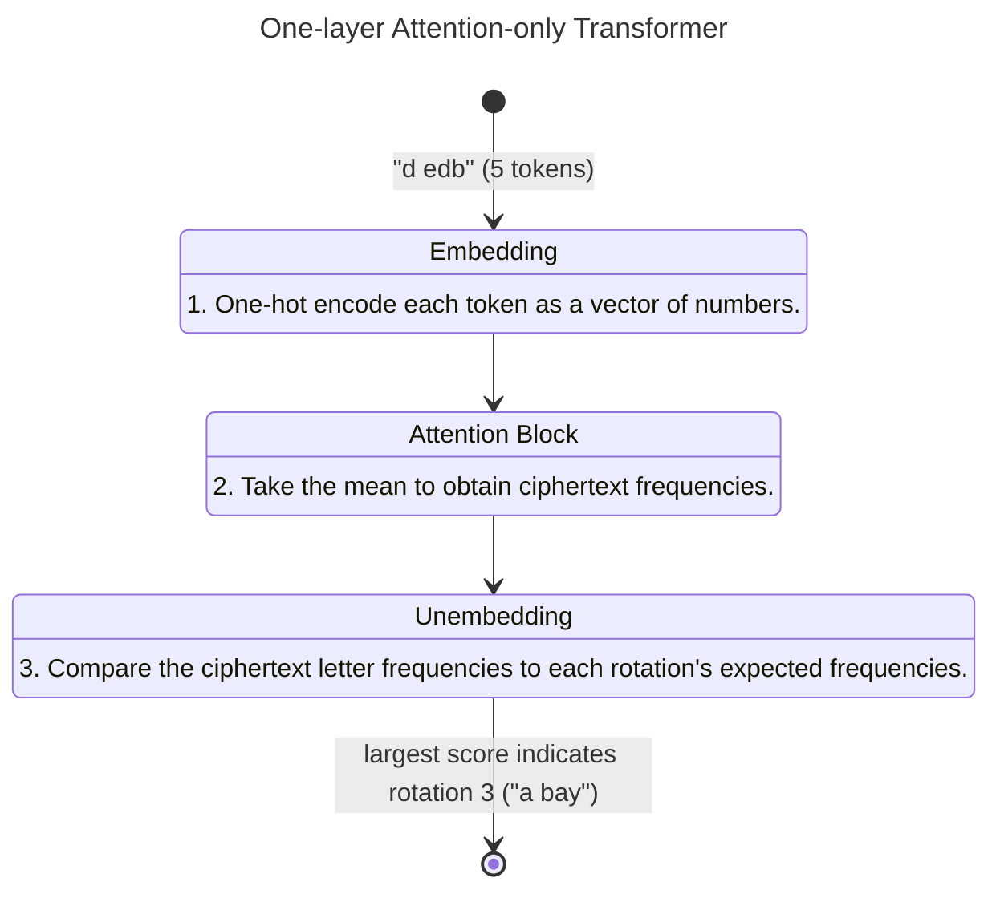

# Transformer Implementation

In this section, we'll take our letter frequency solution and implement it using the transformer architecture as follows:

```mermaid
---
title: One-layer Attention-only Transformer
---
stateDiagram-v2
    Embedding: Embedding
    Embedding: 1. One-hot encode each token as a vector of numbers.
    Attention: Attention Block
    Attention: 2. Take the mean to obtain ciphertext frequencies.
    Unembedding: Unembedding
    Unembedding: 3. Compare the ciphertext letter frequencies to each rotation's expected frequencies.

    [*] --> Embedding: "d edb" (5 tokens)
    Embedding --> Attention
    Attention --> Unembedding
    Unembedding --> [*]: largest score indicates rotation 3 ("a bay")
```
