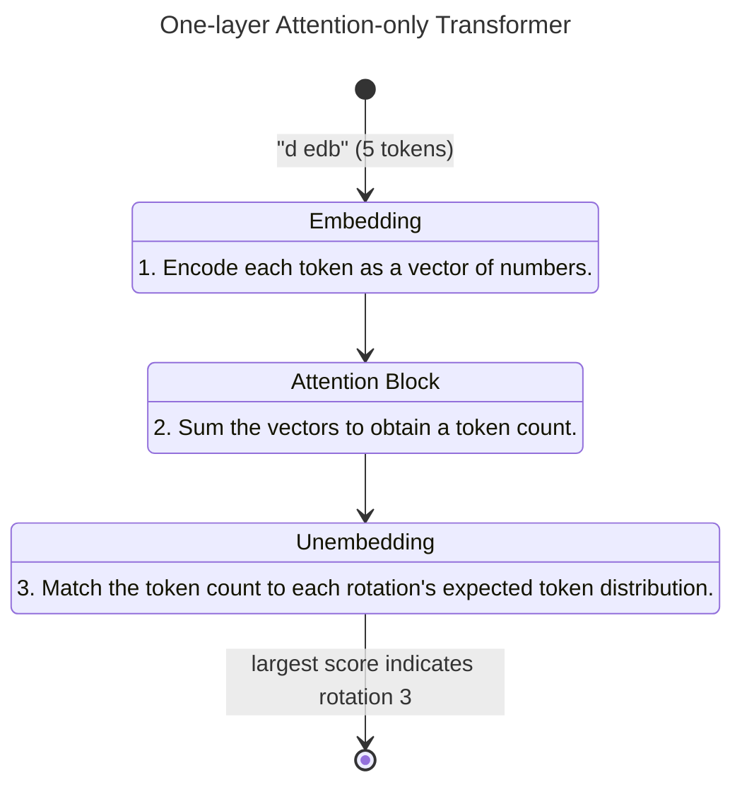

# The Transformer

Humans solve cryptograms by analyzing letter frequency.

> Since `e` is the most common English letter, we can assume the most common ciphertext letter is a rotated `e`.

More generally, we can match the letter frequencies of our ciphertext to the letter frequencies we'd expect to see for each rotation. The "best match" will indicate the most likely rotation.

> Suppose the most common English letters are `etainos`. In our ciphertext, the most common letters are `fubjopt` -- one letter higher. Hence, we can predict a rotation of 1.

To implement this, we will use a transformer. We'll discuss each step in detail soon. For now, let's look at how our vague algorithm can be implemented at a high level using the transformer architecture:

